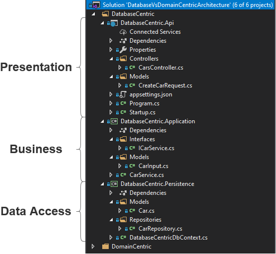

# Database-centric vs domain-centric architecture in ASP.NET Core 3.0
In this sample project we'll review what is the difference between database-centric and domain-centric approach. 

The project is built using ASP.NET Core 3.0 and .NET Standard 2.1.

### What we will focus on:
- Difference between database-centric and domain-centric architecture
- Why we should consider domain-centric approach
- How to rebuild an application from database to domain-centric

### What we will not look at:
 - Architectural styles such as Hexagonal Architecture, The Onion Architecture, The Clean Architecture
 - Domain-Driven-Design practices
 
 
## Database-centric approach
Let's first understand what is database-centric approach. If we review a traditional 3-tier architecture what we have most commonly is presentation, business and data access layers. Presentation layer takes care for the input/output, business layer is where we have our domain specific rules and the data access layer is where we persist the data.

The dependencies in that architecture goes in a way:
- Presentation layer depends on business layer
- Business layer depends on persistence layer and any external dependencies
- Persistence layer talks directly to a database

## The problem with database-centric approach
If we examine the previous diagram in more details we might spot a problem in our business layer. The business or domain logic is the most important part of our solution and because of that we want to make sure it's stable enough. What I mean by that is we must have less dependencies to the outside world, which can force us to make changes in business layer.

Right now our business layer depends on the persistence layer and external components, which means the domain logic might have visibility on database details. In a way we're now coupling our domain with data persistence details. Any change that we introduce inside persistence layer might cause a change inside business layer as well, same for the external components. The problem with dependencies is that something very concrete as changing the repository method because of some MongoDb specific requirement, will break our business rules, then we must fix them which is always introducing risk. What makes more sense is to change the way we persist the data, because of a modification in business rules, but not the other way around.

The end goal is to be able to migrate from SQL Server to MySQL without changing anything inside business layer. 
In real case scenario we might retrieve data from 3rd party application through HTTP protocol or use our own database, the business layer must not be concerned with such details.

So what's the solution?

## Domain-centric approach
Domain-centric architecture describes an approach where the heart of our software is the business (application) layer and the domain. In order to have such architecture, we must make our business layer independent from details as the database, it shouldn't be concerned with the question how we persist the data. In comparison with the database-centric approach now all the dependencies are pointing towards our domain.

In domain-centric application a change in a database will not affect our business rules, because they never depended on the database. A way to achieve that is by applying the [inversion of control principle](https://en.wikipedia.org/wiki/Inversion_of_control).

Domain-centric approach gives us the freedom to easy change between databases and use the right tool for the right job without coupling to it. For different types of data we might want to use databases such as Redis, Amazon Aurora, MongoDb, CosmosDb, etc. and using any of them would not break our domain.

## Architectural styles
The idea of domain-centric approach was born years back and nowadays there are different architectural styles which are sharing the same principles. Few of them are:
- Hexagonal Architecture (a.k.a. Ports and Adapters)
- [The Onion Architecture](https://jeffreypalermo.com/2008/07/the-onion-architecture-part-1/)
- [The Clean Architecture](https://blog.cleancoder.com/uncle-bob/2012/08/13/the-clean-architecture.html)

In all of them we'll see that the main goal is keeping our business rules independent of the framework (UI, database, other agency) so our domain logic is easy testable and a change in any component would be much easier.

## Comparison in action

### Use case
Let's consider the following use case. We have a car dealership inventory system. One of the basic operations that we support is adding a new car. This operation might have some rules such as make and model are required, the car should be built after 1990, etc.

For IO channel we'll use ASP.NET Core 3.0 application which is responsible for handling HTTP requests. After a request hits the API, we'll pass the information to our business layer and then we will store the information inside in-memory database.

### Database-centric approach review

Inside `CarsController` we have a POST action for adding a new car. After a request comes in, we pass the data to the `CarService` where we validate the data and then using `CarRepository` we are storing the data inside in-memory database through Entity Framework Core.

`CarService`:

In order to persist any data `CarService` must use `CarRepository` which is inside our persistence layer. That's where we create the dependency between our business rules and the data access layer. Any change in the way we persist cars, let's say in `CarRepository`, might cause a change in our business layer `CarService`.

In different projects we might also see direct usage of `DbContext` or even things as stored procedures next to our business rules. After expanding the project and adding more and more features it becomes very hard to make changes to existing features. Such projects can easily become unmaintainable and too expensive to expand if we're not careful with coupling.

### Domain-centric approach review
Another way to solve the same problem, but in domain-centric way is to inverse dependencies towards not the persistence, but the application layer.

In this example we still keep api, application and persistence layers, but this time our service doesn't know for any data access related details. Now we have extracted `ICarRepository` inside the application layer and the implementation is done inside the persistence, after that only application layer can dictate changes. If we decide to replace SQL Server database with MySQL, we must implement it in a way that it fits the contract of the application layer.

Comparison of code maps:

## Final words

Domain-centric approach provides:
- better testability
- loosely coupled solution- 
- independence of database
